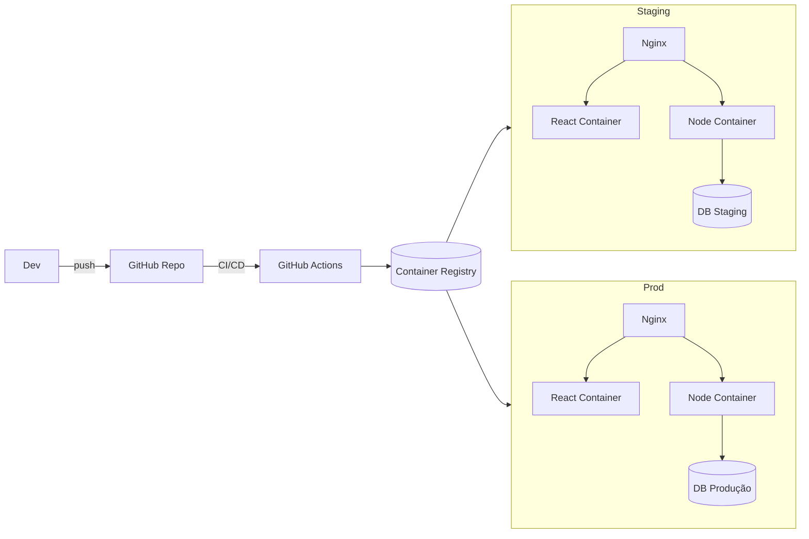
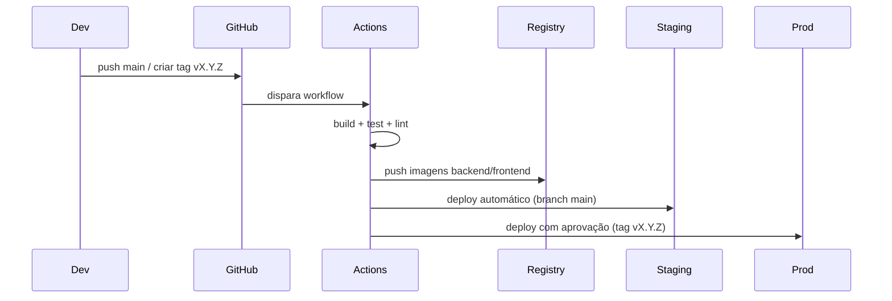

# Q3 — Deploy Automatizado (Node.js + React)

**Autor:** Michael Fernandes  
**Data:** Setembro/2025  

---

## Índice
1. Problema → Causa → Solução
2. Arquitetura
3. Pipeline CI/CD
4. Exemplos práticos (Docker, Compose, Actions)
5. Riscos e Mitigações
6. Futuro (Evolução para Kubernetes)

---

## 1. Problema → Causa → Solução

| Problema | Causa | Solução |
|----------|-------|---------|
| Deploy manual e repetitivo | Empacotamento manual de backend e frontend | CI/CD automatizado com build, testes e deploy |
| Erros humanos em produção | Falta de padronização no empacote e versão | Docker multi-stage + versionamento de imagens |
| Staging e produção fora de sincronia | Deploys em dias diferentes sem rastreabilidade | Fluxo Git: `main` → staging; tags (`vX.Y.Z`) → produção |
| Segredos expostos | Variáveis em `.env` versionadas | Uso de **GitHub Secrets** e `.env` apenas no servidor |
| Sem rollback rápido | Deploy manual não versionado | Imagens versionadas (`sha`, `tag`) + rollback via `docker compose` |
| Downtime no deploy | Substituição direta em produção | Blue/Green simples ou rolling restart com healthcheck |

---

## 2. Arquitetura



## 3. Pipeline CI/CD

## 4. Exemplos práticos

## Backend — backend/Dockerfile
```markdown
```dockerfile
FROM node:20-alpine AS build
WORKDIR /app
COPY package*.json ./
RUN npm ci --only=production


FROM node:20-alpine
WORKDIR /app
COPY --from=build /app /app
EXPOSE 3000
CMD ["node", "server.js"]
```

## Frontend — frontend/Dockerfile

```markdown
```dokerfile

FROM node:20-alpine AS build
WORKDIR /app
COPY package*.json ./
RUN npm ci
COPY . .
RUN npm run build

FROM nginx:alpine
COPY --from=build /app/build /usr/share/nginx/html
EXPOSE 80
```


## docker-compose.staging.yml
```markdown
```Docker-compose
version: "3.9"
services:
  backend:
    image: ghcr.io/<org>/<repo>-backend:${GIT_SHA}
    env_file: /opt/app/.env.staging
    ports: ["3000:3000"]
  frontend:
    image: ghcr.io/<org>/<repo>-frontend:${GIT_SHA}
    ports: ["8080:80"]
  nginx:
    image: nginx:alpine
    volumes:
      - /opt/app/nginx.conf:/etc/nginx/conf.d/default.conf:ro
    ports: ["80:80"]
    depends_on: [backend, frontend]
```

## GitHub Actions — .github/workflows/ci-cd.yml
```markdown
```GitHub Actions 

name: ci-cd

on:
  push:
    branches: [ "main" ]   # staging
    tags:     [ "v*" ]     # produção

jobs:
  build-and-push:
    runs-on: ubuntu-latest
    steps:
      - uses: actions/checkout@v4
      - name: Build backend
        run: docker build -t ghcr.io/org/repo-backend:${{ github.sha }} backend
      - name: Push backend
        run: docker push ghcr.io/org/repo-backend:${{ github.sha }}
      - name: Build frontend
        run: docker build -t ghcr.io/org/repo-frontend:${{ github.sha }} frontend
      - name: Push frontend
        run: docker push ghcr.io/org/repo-frontend:${{ github.sha }}

  deploy-staging:
    if: github.ref == 'refs/heads/main'
    runs-on: ubuntu-latest
    steps:
      - name: SSH Deploy Staging
        uses: appleboy/ssh-action@v1.0.3
        with:
          host: ${{ secrets.STG_HOST }}
          username: ${{ secrets.STG_USER }}
          key: ${{ secrets.STG_SSH_KEY }}
          script: |
            export GIT_SHA=${{ github.sha }}
            cd /opt/app
            docker compose -f docker-compose.staging.yml pull
            docker compose -f docker-compose.staging.yml up -d
```
## 5. Riscos e Mitigações

| Risco                   | Mitigação                          |
|--------------------------|------------------------------------|
| Deploy de versão instável | Testes automáticos no CI           |
| Downtime em produção      | Blue/Green + Healthcheck           |
| Falha em migrações        | Backup automático + rollback       |
| Segredos expostos         | GitHub Secrets e `.env` no servidor|
| Falta de monitoramento    | Endpoint `/healthz` + logs Nginx   |

---

## 6. Futuro (Evolução)

- **Infra como código**: Terraform/Ansible para provisionamento de servidores.  
- **Kubernetes**: EKS/GKE/AKS para escalabilidade.  
- **Observabilidade avançada**:  
  - Prometheus + Grafana (métricas)  
  - Loki/ELK (logs)  
- **Feature Flags**: ativar/desativar funcionalidades sem deploy.  

---

## Conclusão

Automatizar o pipeline de deploy resolve os problemas de falhas humanas, inconsistência entre ambientes e falta de rollback.  
Com essa abordagem, o cliente terá:

- Deploy previsível e rastreável  
- Staging sempre alinhado à produção  
- Rollback em minutos  
- Base sólida para evoluir para Kubernetes no futuro  
